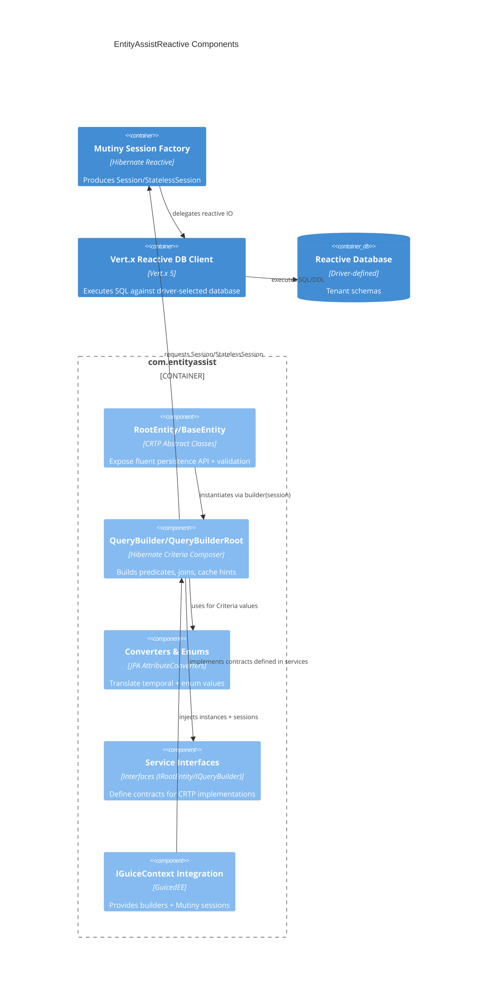

# C4 Component — EntityAssistReactive Module

## Implementation Notes
- `RootEntity` exposes helper methods (`persist`, `update`) that delegate to the matching query builder and operate on `Uni` of the entity type.
- Query builders rely on `IGuiceContext` to resolve both builders and the shared `Mutiny.SessionFactory`; this necessitates Guice bindings in consuming apps.
- Attribute converters (LocalDate/LocalDateTime) ensure compatibility with JDBC/Vert.x mappings regardless of whether the host uses PostgreSQL, MySQL, or another supported driver.
