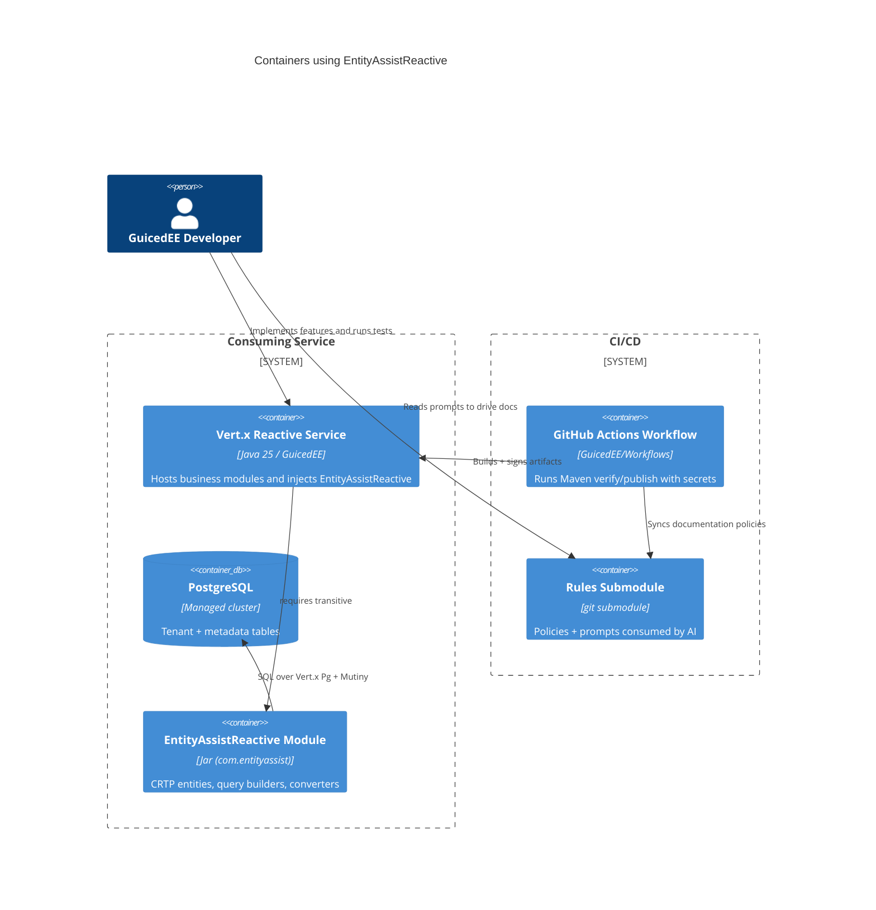

# C4 Container — Reactive Stack

## Observations
- The EntityAssist module sits inside the consuming Vert.x container but maintains its own lifecycle (JPMS exports/opens).
- GitHub Actions consumes both source and rules; documentation updates must keep `.gitmodules` intact.
- Reactive database credentials pass through environment variables; `.env.example` (Stage 2) will outline expected names regardless of the underlying driver.
