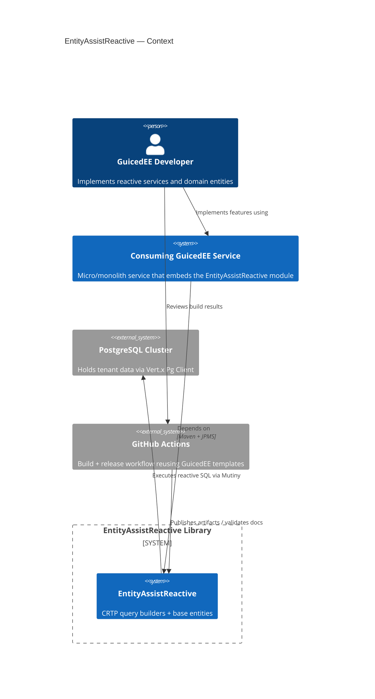

# C4 Context — EntityAssistReactive

## Notes
- EntityAssistReactive is consumed as a module rather than a standalone system; the boundary ensures we track where the rules repository applies.
- A Vert.x reactive SQL driver (PostgreSQL via vertx-pg-client today) is the authoritative data source; hosts may swap drivers as required.
- GitHub Actions is both CI/CD and a compliance boundary because GPG/Sonatype secrets transit there.
