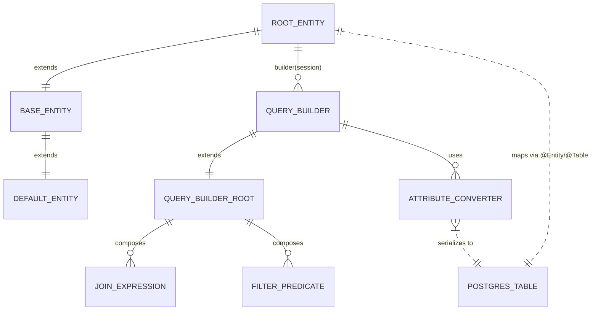

# ERD — EntityAssistReactive Core

## Interpretation
- The ERD represents abstract relationships because concrete entity tables are not included in the repository yet.
- `FILTER_PREDICATE` aggregates Hibernate Criteria predicates derived from enumerations such as `OrderByType`, `Operand`, and `SelectAggregate`.
- Attribute converters wrap date/time conversions that Vert.x reactive drivers (PostgreSQL, MySQL, MSSQL, etc.) expect.

## Next Steps
- Once domain modules land, extend this ERD with actual entity names and relationships; keep the abstract portion for library-level behavior.
