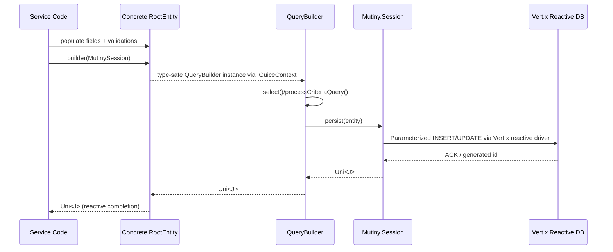

# Sequence — Persisting a CRTP Entity

## Highlights
- `builder(session)` obtains an injected builder, preventing manual construction mistakes.
- Cache hints and join processing occur before the Mutiny session call (per `QueryBuilder.select()` logic).
- All persistence returns a `Uni<J>`, so services should compose with Mutiny rather than blocking.
