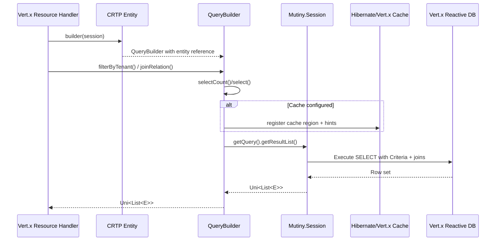

# Sequence — Query with Filters & Cache

## Highlights
- `QueryBuilder` lazily composes the criteria query; `getQuery()` ensures `select()` ran.
- Cache hints only apply when `setCacheName`/`setCacheRegion` are configured.
- Service handlers must subscribe to `Uni` inside Vert.x event-loop friendly contexts.
